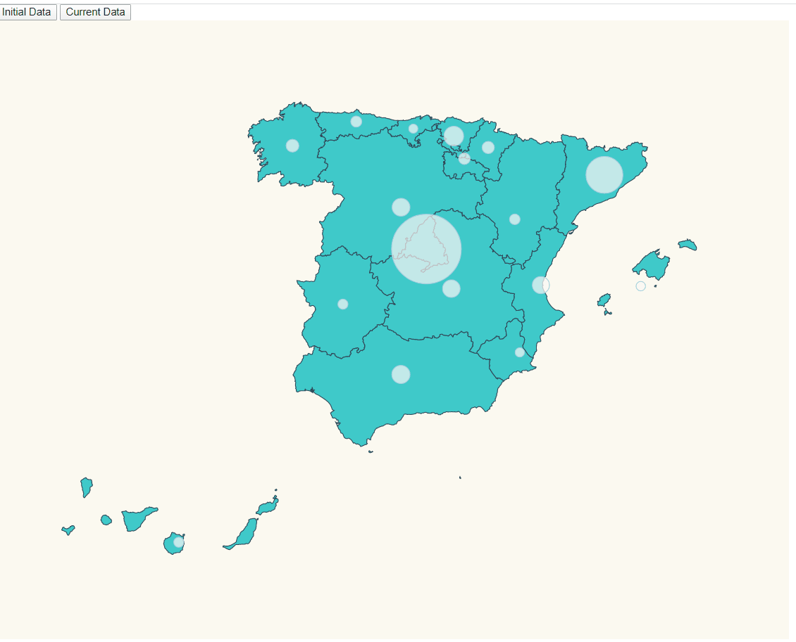

# Pinning locations + scale (Spain Map) + Update MapView (2 source data)

We want to develop a spanish map pointing the infected cases by covid19 (coronavirus) in all the spanish regions.
For that we display something like this:




We have to face three topics here:

- Place pins on a map based on regions.
- Scale pin radius based on affected number.


# First Steps

- Using the base from our friends of {Lemoncode} we will: 

    * Take as starting example 02-pin-location-scale , let's copy the content from that folder and execute _npm install_.

```bash
npm install
```

    * This time we will Spain topojson info: https://github.com/deldersveld/topojson/blob/master/countries/spain/spain-comunidad-with-canary-islands.json
      Let's copy it under the following route _./data/spain.json_
      

- If we run the project, we can see a map of spain, we have to re-scale our map: 
      * Let's start by adding the right size to be displayed in our screen.

_./src/index.ts_

const aProjection = d3Composite
  .geoConicConformalSpain()
  .scale(3300)
  .translate([500, 400]);
  
 
- If we run the project we can check that the map is now renders in a proper size and position 
  and now we need to reposition Canary Islands, in order to do that we can build a
  map projection that positions that piece of land in another place.
  For that, we use:
    https://bl.ocks.org/mbostock/2869946, there's a very helpfull project created by
    [Roger Veciana](https://github.com/rveciana) 
   That implements a lot of projections for several maps:

      * [Project site](https://geoexamples.com/d3-composite-projections/)
      * [Github project](https://github.com/rveciana/d3-composite-projections)


      * Let's install the library that contains this projections:
          ```bash
          npm install d3-composite-projections --save
          ```
      * And Import into our project:
          const d3Composite = require("d3-composite-projections");
      
      Now, we change the projection, being that way:
      
          const aProjection = d3Composite
                .geoConicConformalSpain()
                .scale(3300)
                .translate([500, 400]);
             

Now, We have the map working fine!!

# Next Steps

  - In order to draw our circles in each region we have to create one file with Regions and Coordinates:
  
      _./src/communities.ts_
    
  ```typescript
      export const latLongCommunities = [
        {
          name: "Madrid",
          long: -3.70256,
          lat: 40.4165
        },
        {
          name: "AndalucĂ­a",
          long: -4.5,
          lat: 37.6
        },
        {
          name: "Valencia",
          long: -0.37739,
          lat: 39.45975
        },
        {
          name: "Murcia",
          long: -1.13004,
          lat: 37.98704
        },
        {
          name: "Extremadura",
          long: -6.16667,
          lat: 39.16667
        },
        {
          name: "CataluĂąa",
          long: 1.86768,
          lat: 41.82046
        },
        {
          name: "PaĂ­s Vasco",
          long: -2.75,
          lat: 43.0
        },
        {
          name: "Cantabria",
          long: -4.03333,
          lat: 43.2
        },
        {
          name: "Asturias",
          long: -5.86112,
          lat: 43.36662
        },
        {
          name: "Galicia",
          long: -7.86621,
          lat: 42.75508
        },
        {
          name: "AragĂłn",
          long: -1.0,
          lat: 41.0
        },
        {
          name: "Castilla y LeĂłn",
          long: -4.45,
          lat: 41.383333
        },
        {
          name: "Castilla La Mancha",
          long: -3.000033,
          lat: 39.500011
        },
        {
          name: "Islas Canarias",
          long: -15.5,
          lat: 28.0
        },
        {
          name: "Islas Baleares",
          long: 2.52136,
          lat: 39.18969
        },
        {
          name: "La Rioja",
          long: -2.44373,
          lat: 42.4650
        },
        {
          name: "Navarra",
          long: -1.676069,
          lat: 42.695391
        }
      ];
      ´´´
  
      * Import the file in our project:
            import { latLongCommunities } from "./communities";
  
  
      *  Now, we can draw our circles:
        ``` Typescript - _./src/index.ts_
              const circles = svg.selectAll("circle");

              circles
                .data(latLongCommunities)
                .enter()
                .append("circle")
                .attr("class", "affected-marker")
                .attr("r", function(d) {
                  return calculateRadiusBasedOnAffectedCases(d.name);
                })
                .attr("cx", d => aProjection([d.long, d.lat])[0])
                .attr("cy", d => aProjection([d.long, d.lat])[1])

                .merge(circles as any)
                .transition()
                .duration(500)
                .attr("r", function(d) {
                  return calculateRadiusBasedOnAffectedCases(d.name);
                });
              };
            ´´´ 
            
      * We make a new file to read our values. But, as you can see bellow, we use an interface
        because we want to update our map with different data sources (2 data points in our case) 
            
            ```Typescript - ./stats.ts
                export interface InfectedEntry {
                    name: string;
                    value: number;
                  }

                  export const base_stats: InfectedEntry[] = [
                    {
                      name: "Madrid",
                      value: 587
                    },
                    {
                      name: "La Rioja",
                      value: 102
                    },
                    {
                      name: "AndalucĂ­a",
                      value: 54
                    },
                    {
                      name: "CataluĂąa",
                      value: 101
                    },
                    {
                      name: "Valencia",
                      value: 50
                    },
                    {
                      name: "Murcia",
                      value: 5
                    },
                    {
                      name: "Extremadura",
                      value: 7
                    },
                    {
                      name: "Castilla La Mancha",
                      value: 26
                    },
                    {
                      name: "PaĂ­s Vasco",
                      value: 148
                    },
                    {
                      name: "Cantabria",
                      value: 12
                    },
                    {
                      name: "Asturias",
                      value: 10
                    },
                    {
                      name: "Galicia",
                      value: 18
                    },
                    {
                      name: "AragĂłn",
                      value: 32
                    },
                    {
                      name: "Castilla y LeĂłn",
                      value: 40
                    },
                    {
                      name: "Islas Canarias",
                      value: 24
                    },
                    {
                      name: "Islas Baleares",
                      value: 11
                    },
                    {
                      name: "Navarra",
                      value: 13
                    }
                  ];


                  export const current_stats: InfectedEntry[] = [
                    {
                      name: "Madrid",
                      value: 8921
                    },
                    {
                      name: "La Rioja",
                      value: 564
                    },
                    {
                      name: "AndalucĂ­a",
                      value: 1515
                    },
                    {
                      name: "CataluĂąa",
                      value: 4203
                    },
                    {
                      name: "Valencia",
                      value: 1363
                    },
                    {
                      name: "Murcia",
                      value: 240
                    },
                    {
                      name: "Extremadura",
                      value: 354
                    },
                    {
                      name: "Castilla La Mancha",
                      value: 1423
                    },
                    {
                      name: "PaĂ­s Vasco",
                      value: 1725
                    },
                    {
                      name: "Cantabria",
                      value: 215
                    },
                    {
                      name: "Asturias",
                      value: 486
                    },
                    {
                      name: "Galicia",
                      value: 739
                    },
                    {
                      name: "AragĂłn",
                      value: 424
                    },
                    {
                      name: "Castilla y LeĂłn",
                      value: 1466
                    },
                    {
                      name: "Islas Canarias",
                      value: 348
                    },
                    {
                      name: "Islas Baleares",
                      value: 246
                    },
                    {
                      name: "Navarra",
                      value: 664
                    }
                  ];
            ´´´
        * And import this data source in our project:
              import {
                  base_stats,
                  current_stats,
                  InfectedEntry
                } from "./stats";
        
        * Print 2 buttons in our code, to select the different data:
            ``` Typescript _/src/index.html_
              
                  <body>
                    </div>
                        <button id="initial">Initial Data</button>
                        <button id="current">Current Data</button>
                    </div>
                    <div>
                        <script src="./index.ts"></script>
                    </div>
            
            ```Typescript _/src/index.ts_
            
               document
                 .getElementById("initial")
                 .addEventListener("click", function handleBaseResults() {
                   updateMap(base_stats);
                 });

               document
                 .getElementById("current")
                 .addEventListener("click", function handleCurrentResults() {
                   updateMap(current_stats);
                 }); 
            ´´´
        
        *  Now Apply a good style to our project:
            
         ``` Typescript 
         
            .country {
              stroke-width: 1;
              stroke: #2f4858;
              fill: #3fc9c9;
            }


            .affected-marker {
              stroke-width: 1;
              stroke: hsl(197, 45%, 76%);
              fill: #fcf6f6;
              fill-opacity: 0.7;
            }
           
           ´´´
      
      
      Enjoy your MAP!!
      
